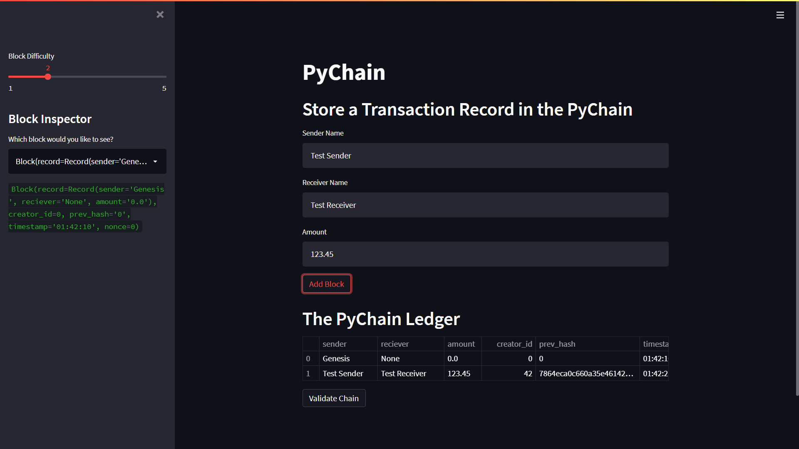

# 18_Blockchain
Blockchain transaction ledger using streamlit interface

---
## Usage

- Users enter sender, receiver, and amount of the transaction to add to the blockchain. 
- Block details can be viewed by choosing from a list in the left panel of the app.

To install and run the app, issue the following commands from the command prompt:
1. Copy the files to your computer
```shell
git clone https://github.com/rdillens/18_Blockchain.git
```
2. Navigate to the folder just created 
```shell
cd 18_Blockchain
```
3. Run the app
```shell
streamlit run pychain.py
```

---
## Example


---
## Contributors
All code was written by Remy Dillenseger